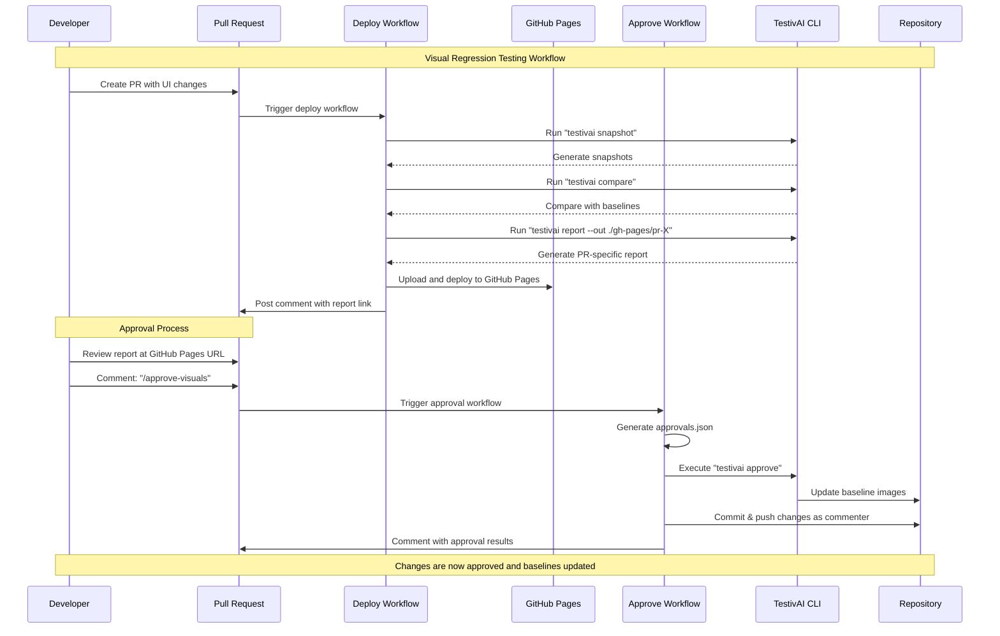

# TestivAI Visual Regression Approval Action

A GitHub Action that allows developers to approve or reject visual regression changes generated by TestivAI directly through PR comments.

## Overview

This action listens for specific comment formats in pull requests and processes them to approve or reject visual regression changes. It updates the necessary files and commits the changes back to the PR branch.


### The Problem

Visual regression testing is a critical part of modern web development, but the approval workflow can be cumbersome:

1. Developers need to review visual differences
2. They must decide which changes are intentional vs. bugs
3. Approved changes need to be committed as new baselines
4. This process often requires context switching between tools

### The Solution

This GitHub Action streamlines the workflow by:

1. Allowing approvals/rejections directly in PR comments
2. Automatically updating the approvals.json file
3. Running the TestivAI CLI to update baseline images
4. Committing changes back to the PR branch with proper attribution

## Features

- Approve or reject visual regression changes directly from PR comments
- Support for both global approvals and specific file approvals
- Automatic updating of baseline images
- Detailed metadata tracking for audit purposes
- Seamless integration with TestivAI's visual regression testing
- Automatic posting of visual regression reports to PR comments

## Usage

### Step 1: Set Up the Workflows

You'll need two GitHub Actions workflows:

1. **Deploy Workflow**: Runs TestivAI commands and deploys reports to GitHub Pages
2. **Approval Workflow**: Processes approval comments and updates baselines

#### Deploy Workflow

Create a `.github/workflows/deploy-pages.yml` file:

```yaml
name: Deploy TestivAI Report to GitHub Pages

on:
  push:
    branches:
      - main
  pull_request:
    types: [opened, synchronize, reopened]

# Sets permissions of the GITHUB_TOKEN to allow deployment to GitHub Pages
permissions:
  contents: read
  pages: write
  id-token: write
  issues: write
  pull-requests: write

# Allow only one concurrent deployment
concurrency:
  group: "pages"
  cancel-in-progress: true

jobs:
  build-and-deploy:
    runs-on: ubuntu-latest
    environment:
      name: github-pages
      url: ${{ steps.deployment.outputs.page_url }}
    
    steps:
      - name: Checkout repository
        uses: actions/checkout@v3
      
      - name: Setup Node.js
        uses: actions/setup-node@v3
        with:
          node-version: '16'
          cache: 'npm'
      
      - name: Install dependencies
        run: npm ci
      
      - name: Setup Pages
        uses: actions/configure-pages@v3
      
      - name: Run TestivAI commands for PR
        if: github.event_name == 'pull_request'
        run: |
          mkdir -p ./gh-pages/pr-${{ github.event.pull_request.number }}
          npx testivai snapshot
          npx testivai compare
          npx testivai report --out ./gh-pages/pr-${{ github.event.pull_request.number }}
      
      - name: Run TestivAI commands for main branch
        if: github.event_name == 'push' && github.ref == 'refs/heads/main'
        run: |
          mkdir -p ./gh-pages
          npx testivai snapshot
          npx testivai compare
          npx testivai report --out ./gh-pages
      
      - name: Upload Pages artifact
        uses: actions/upload-pages-artifact@v1
        with:
          path: './gh-pages'
      
      - name: Deploy to GitHub Pages
        id: deployment
        uses: actions/deploy-pages@v2
      
      - name: Post PR Comment with Report Link
        if: github.event_name == 'pull_request'
        run: node ./scripts/post-pr-comment.js
        env:
          GITHUB_TOKEN: ${{ secrets.GITHUB_TOKEN }}
          PR_NUMBER: ${{ github.event.pull_request.number }}
```

#### Approval Workflow

Create a `.github/workflows/approve-comment.yml` file:

```yaml
name: TestivAI Approve Visuals Comment

on:
  issue_comment:
    types: [created]

jobs:
  process-approval:
    runs-on: ubuntu-latest
    # Only run on PR comments that contain the approval command
    if: |
      github.event.issue.pull_request &&
      contains(github.event.comment.body, '/approve-visuals')
    
    permissions:
      contents: write  # Needed to push changes back to the branch
      pull-requests: write  # Needed to comment on PRs
    
    steps:
      - name: Checkout repository
        uses: actions/checkout@v3
        with:
          ref: ${{ github.event.issue.pull_request.head.ref }}
          fetch-depth: 0
      
      - name: Setup Node.js
        uses: actions/setup-node@v3
        with:
          node-version: '16'
      
      - name: Get commenter info
        id: commenter
        run: |
          echo "username=${{ github.event.comment.user.login }}" >> $GITHUB_OUTPUT
          echo "email=${{ github.event.comment.user.login }}@users.noreply.github.com" >> $GITHUB_OUTPUT
      
      - name: Generate approvals.json
        run: node ./scripts/create-approvals.js
        env:
          GITHUB_COMMENTER: ${{ steps.commenter.outputs.username }}
          PR_NUMBER: ${{ github.event.issue.number }}
          REPO_OWNER: ${{ github.repository_owner }}
          REPO_NAME: ${{ github.event.repository.name }}
          COMMIT_SHA: ${{ github.sha }}
          APPROVALS_PATH: .testivai/visual-regression/approvals.json
      
      - name: Install TestivAI
        run: npm install -g testivai
      
      - name: Run TestivAI approve
        run: npx testivai approve --from .testivai/visual-regression/approvals.json
      
      - name: Configure Git
        run: |
          git config user.name "${{ steps.commenter.outputs.username }}"
          git config user.email "${{ steps.commenter.outputs.email }}"
      
      - name: Commit and push changes
        run: |
          git add .
          git diff --staged --quiet || git commit -m "chore: update visual regression baselines [skip ci]"
          git push origin ${{ github.event.issue.pull_request.head.ref }}
      
      - name: Comment on PR with results
        uses: actions/github-script@v6
        with:
          github-token: ${{ secrets.GITHUB_TOKEN }}
          script: |
            const message = '✅ Visual regression changes approved and baselines updated!\n\n' +
                           'All visual changes have been approved and the baseline images have been updated.';
            
            github.rest.issues.createComment({
              issue_number: context.issue.number,
              owner: context.repo.owner,
              repo: context.repo.repo,
              body: message
            });
```

### Step 2: Create Required Scripts

You'll need two helper scripts:

#### PR Comment Script

Create a `scripts/post-pr-comment.js` file:

```javascript
const core = require('@actions/core');
const github = require('@actions/github');

async function run() {
  try {
    // Get token from environment variable
    const token = process.env.GITHUB_TOKEN;
    if (!token) {
      core.setFailed('GITHUB_TOKEN environment variable is required');
      return;
    }
    
    // Initialize GitHub client
    const octokit = github.getOctokit(token);
    
    // Get context
    const context = github.context;
    const repo = context.repo;
    
    // Check if we're in a PR context
    let prNumber;
    
    if (context.payload.pull_request) {
      // Direct PR event
      prNumber = context.payload.pull_request.number;
    } else if (context.payload.issue && context.payload.issue.pull_request) {
      // Issue comment on a PR
      prNumber = context.payload.issue.number;
    } else if (process.env.PR_NUMBER) {
      // From environment variable (set in workflow)
      prNumber = process.env.PR_NUMBER;
    } else {
      // Try to extract from ref (e.g., refs/pull/123/merge)
      const prMatch = context.ref.match(/refs\/pull\/(\d+)\/merge/);
      if (prMatch) {
        prNumber = prMatch[1];
      }
    }
    
    if (!prNumber) {
      core.warning('Could not determine PR number. Skipping comment posting.');
      return;
    }
    
    // Construct the GitHub Pages URL
    const pagesUrl = `https://${repo.owner}.github.io/${repo.repo}/pr-${prNumber}/`;
    
    // Create comment message
    const message = `🧪 TestivAI Report Ready — View at: [${pagesUrl}](${pagesUrl}) — Comment \`/approve-visuals\` to accept changes.`;
    
    // Post comment to PR
    await octokit.rest.issues.createComment({
      ...repo,
      issue_number: prNumber,
      body: message
    });
    
    core.info(`Posted comment to PR #${prNumber} with report link: ${pagesUrl}`);
    
  } catch (error) {
    core.setFailed(`Action failed: ${error.message}`);
  }
}

run();
```

#### Approvals Script

Create a `scripts/create-approvals.js` file:

```javascript
const fs = require('fs-extra');
const path = require('path');

/**
 * Create an approvals.json file with the specified structure
 * 
 * @param {Object} options - Options for creating the approvals file
 * @param {string} options.author - GitHub username of the commenter
 * @param {string} options.prNumber - PR number
 * @param {string} options.repoOwner - Repository owner
 * @param {string} options.repoName - Repository name
 * @param {string} options.commitSha - Commit SHA
 * @param {string} options.outputPath - Path to write the approvals.json file
 * @returns {Promise<string>} - Path to the created approvals file
 */
async function createApprovalsFile({
  author,
  prNumber,
  repoOwner,
  repoName,
  commitSha,
  outputPath = '.testivai/visual-regression/approvals.json'
}) {
  // Create the approvals data structure
  const approvalsData = {
    approved: ['ALL'],
    rejected: [],
    new: [],
    deleted: [],
    meta: {
      author,
      timestamp: new Date().toISOString(),
      source: `GitHub PR #${prNumber}`,
      pr_url: `https://github.com/${repoOwner}/${repoName}/pull/${prNumber}`,
      commit_sha: commitSha,
      commit_url: `https://github.com/${repoOwner}/${repoName}/commit/${commitSha}`
    }
  };

  // Ensure the directory exists
  await fs.ensureDir(path.dirname(outputPath));

  // Write the approvals file
  await fs.writeJson(outputPath, approvalsData, { spaces: 2 });

  console.log(`Created approvals file at ${outputPath}`);
  return outputPath;
}

// If this script is run directly from the command line
if (require.main === module) {
  const author = process.env.GITHUB_COMMENTER || process.argv[2];
  const prNumber = process.env.PR_NUMBER || process.argv[3];
  const repoOwner = process.env.REPO_OWNER || process.argv[4];
  const repoName = process.env.REPO_NAME || process.argv[5];
  const commitSha = process.env.COMMIT_SHA || process.argv[6];
  const outputPath = process.env.APPROVALS_PATH || process.argv[7] || '.testivai/visual-regression/approvals.json';

  if (!author || !prNumber || !repoOwner || !repoName || !commitSha) {
    console.error('Missing required parameters.');
    process.exit(1);
  }

  createApprovalsFile({
    author,
    prNumber,
    repoOwner,
    repoName,
    commitSha,
    outputPath
  }).catch(error => {
    console.error(`Error creating approvals file: ${error.message}`);
    process.exit(1);
  });
}

module.exports = { createApprovalsFile };
```

### Step 2: Use the commands in PR comments

Once the workflow is set up, you can use the following commands in PR comments:

- `/approve-visuals` - Approve all visual regression changes
- `/approve-visuals filename.png` - Approve a specific visual regression change
- `/reject-visuals filename.png` - Reject a specific visual regression change

Examples:

**Global approval (approves all changes):**
```
/approve-visuals
```

**Specific file approval:**
```
/approve-visuals login.png
```

**Multiple file approval:**
```
/approve-visuals header.png footer.png sidebar.png
```

**Rejecting a specific file:**
```
/reject-visuals settings.png
```

### Step 3: Verify the results

After submitting a comment with an approval or rejection command:

1. The GitHub Action will run automatically
2. It will update the approvals.json file with your decisions
3. It will execute the TestivAI CLI to update baseline images
4. Changes will be committed back to the PR branch
5. A comment will be added to the PR with the results

## Inputs

| Name | Description | Required | Default |
|------|-------------|----------|---------|
| `github-token` | GitHub token for authentication | Yes | `${{ github.token }}` |
| `approvals-path` | Path to the approvals.json file | No | `.testivai/visual-regression/report/approvals.json` |
| `report-path` | Path to the TestivAI report.json file | No | `.testivai/visual-regression/report/report.json` |
| `diff-directory` | Directory containing visual diff images | No | `.testivai/visual-regression/report/diff` |
| `commit-message` | Custom commit message for approved changes | No | `chore: update visual regression baselines [skip ci]` |
| `post-report-comment` | Whether to post a report comment to the PR | No | `true` |

## Outputs

| Name | Description |
|------|-------------|
| `approved-files` | List of approved visual regression files |
| `rejected-files` | List of rejected visual regression files |
| `result` | Result of the approval process (success/failure) |

## Permissions

This action requires the following permissions:

```yaml
permissions:
  contents: write  # Needed to push changes back to the branch
  pull-requests: write  # Needed to comment on PRs
```

## How It Works

1. When a PR comment is created with one of the approval/rejection commands, the workflow is triggered
2. The action parses the comment to determine the intent (approve all, approve specific, reject specific)
3. It updates the approvals.json file with the appropriate entries and metadata
4. It runs the TestivAI CLI to update baseline images for approved changes
5. It commits and pushes the changes back to the PR branch
6. It posts a summary of the visual regression report to the PR
7. It comments on the PR with the results of the approval/rejection process

### Complete Visual Workflow



### Using `/approve-visuals` in PR Comments

The approval workflow is designed to be simple and intuitive:

1. **View the Report**: When a PR is created or updated, the deploy workflow automatically runs TestivAI commands and deploys a report to GitHub Pages. A comment is posted on the PR with a link to the report.

2. **Review Visual Changes**: Click the link in the PR comment to view the visual regression report. This shows you all the visual differences between the current PR and the baseline.

3. **Approve Changes**: If the visual changes are intentional and correct, simply add a comment to the PR with:
   ```
   /approve-visuals
   ```

4. **Automatic Processing**: The approval workflow will:
   - Generate an approvals.json file with "approved": ["ALL"]
   - Run TestivAI approve to update baseline images
   - Commit and push the changes back to the PR branch
   - The commit will be attributed to you (using your GitHub username)
   - A confirmation comment will be posted on the PR

5. **Verification**: The updated baseline images will be included in the PR, and subsequent visual regression tests will use these new baselines.

### Approvals.json Format

The action updates the approvals.json file with the following structure:

```json
{
  "approved": [
    "login.png",
    "header.png"
  ],
  "rejected": [
    "settings.png"
  ],
  "new": [
    "signup.png"
  ],
  "deleted": [
    "old-dashboard.png"
  ],
  "meta": {
    "author": "github-username",
    "timestamp": "2025-06-16T12:34:56Z",
    "source": "GitHub PR Comment",
    "pr_url": "https://github.com/owner/repo/pull/123",
    "commit_sha": "abc123def456",
    "commit_url": "https://github.com/owner/repo/commit/abc123def456"
  }
}
```

## Report Comments

When the action processes approvals or rejections, it can automatically post a comment to the PR with a summary of the visual regression report. This feature is enabled by default and can be disabled by setting the `post-report-comment` input to `false`.

The report comment includes:

- A summary of the test results (total tests, passed tests, failed tests)
- A list of approved changes
- A list of rejected changes
- Instructions for approving or rejecting changes
- A link to the full report

Example report comment:

```markdown
## TestivAI Visual Regression Report

### Summary

- Total Tests: 10
- Passed Tests: 8
- Failed Tests: 2
- Approved Changes: 2
- Rejected Changes: 1

### Approved Changes

- ✅ login.png
- ✅ header.png

### Rejected Changes

- ❌ settings.png

### How to Approve/Reject Changes

- To approve all changes: `/approve-visuals`
- To approve a specific file: `/approve-visuals filename.png`
- To reject a specific file: `/reject-visuals filename.png`

[View Full Report](../blob/HEAD/.testivai/visual-regression/report/index.html)
```

## Troubleshooting

### Common Issues

#### Permission Errors

If you see errors related to pushing changes:

```
Error: Git operation failed: Permission denied (publickey)
```

**Solution**: Ensure your workflow has the correct permissions:

```yaml
permissions:
  contents: write  # Needed to push changes back to the branch
  pull-requests: write  # Needed to comment on PRs
```

#### TestivAI CLI Not Found

If the action fails with:

```
Error: TestivAI CLI not found and installation failed
```

**Solution**: The action will attempt to install TestivAI CLI automatically. If this fails, you can add a step to install it manually:

```yaml
- name: Install TestivAI CLI
  run: npm install -g testivai
```

#### No Changes Detected

If you approve changes but nothing happens:

**Solution**: Verify that:
1. TestivAI has detected visual differences
2. The diff files exist in the expected location
3. The PR comment format is correct

### Getting Help

If you encounter issues not covered here:

1. Check the action logs for detailed error messages
2. Verify your TestivAI setup is correct
3. Open an issue on the GitHub repository with details about your problem

## Requirements

- TestivAI must be set up in your project
- The workflow must have write permissions to the repository

## Contributing

Contributions are welcome! Please feel free to submit a Pull Request.

## License

This project is licensed under the MIT License - see the LICENSE file for details.
