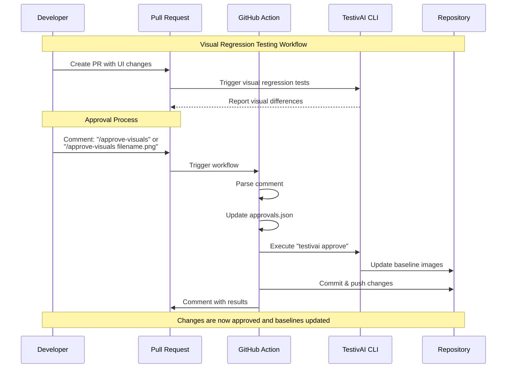

# TestivAI Visual Regression Approval Action

A GitHub Action that allows developers to approve or reject visual regression changes generated by TestivAI directly through PR comments.

## Overview

This action listens for specific comment formats in pull requests and processes them to approve or reject visual regression changes. It updates the necessary files and commits the changes back to the PR branch.


### The Problem

Visual regression testing is a critical part of modern web development, but the approval workflow can be cumbersome:

1. Developers need to review visual differences
2. They must decide which changes are intentional vs. bugs
3. Approved changes need to be committed as new baselines
4. This process often requires context switching between tools

### The Solution

This GitHub Action streamlines the workflow by:

1. Allowing approvals/rejections directly in PR comments
2. Automatically updating the approvals.json file
3. Running the TestivAI CLI to update baseline images
4. Committing changes back to the PR branch with proper attribution

## Features

- Approve or reject visual regression changes directly from PR comments
- Support for both global approvals and specific file approvals
- Automatic updating of baseline images
- Detailed metadata tracking for audit purposes
- Seamless integration with TestivAI's visual regression testing

## Usage

### Step 1: Add the workflow file

Create a `.github/workflows/testivai-approve.yml` file in your repository:

```yaml
name: TestivAI Visual Regression Approval

on:
  issue_comment:
    types: [created]

jobs:
  process-approval:
    runs-on: ubuntu-latest
    # Only run on PR comments that contain the approval commands
    if: |
      github.event.issue.pull_request &&
      (contains(github.event.comment.body, '/approve-visuals') || 
       contains(github.event.comment.body, '/reject-visuals'))
    
    permissions:
      contents: write  # Needed to push changes back to the branch
      pull-requests: write  # Needed to comment on PRs
    
    steps:
      - name: Checkout repository
        uses: actions/checkout@v3
        with:
          ref: ${{ github.event.pull_request.head.ref }}
          fetch-depth: 0
      
      - name: Process visual approval/rejection
        uses: testivai/visual-approval-action@v1
        id: visual-approval
        with:
          github-token: ${{ secrets.GITHUB_TOKEN }}
      
      - name: Comment on PR with results
        if: always()
        uses: actions/github-script@v6
        with:
          github-token: ${{ secrets.GITHUB_TOKEN }}
          script: |
            const result = ${{ steps.visual-approval.outputs.result }};
            const approvedFiles = ${{ steps.visual-approval.outputs.approved-files || '[]' }};
            const rejectedFiles = ${{ steps.visual-approval.outputs.rejected-files || '[]' }};
            
            let message = '';
            
            if (result === 'success') {
              message = '✅ Visual regression changes processed successfully!\n\n';
              
              if (approvedFiles.length > 0) {
                message += '**Approved files:**\n';
                approvedFiles.forEach(file => {
                  message += `- ${file}\n`;
                });
                message += '\n';
              }
              
              if (rejectedFiles.length > 0) {
                message += '**Rejected files:**\n';
                rejectedFiles.forEach(file => {
                  message += `- ${file}\n`;
                });
                message += '\n';
              }
            } else {
              message = '❌ Failed to process visual regression changes. Please check the action logs for details.';
            }
            
            github.rest.issues.createComment({
              issue_number: context.issue.number,
              owner: context.repo.owner,
              repo: context.repo.repo,
              body: message
            });
```

### Step 2: Use the commands in PR comments

Once the workflow is set up, you can use the following commands in PR comments:

- `/approve-visuals` - Approve all visual regression changes
- `/approve-visuals filename.png` - Approve a specific visual regression change
- `/reject-visuals filename.png` - Reject a specific visual regression change

Examples:

**Global approval (approves all changes):**
```
/approve-visuals
```

**Specific file approval:**
```
/approve-visuals login.png
```

**Multiple file approval:**
```
/approve-visuals header.png footer.png sidebar.png
```

**Rejecting a specific file:**
```
/reject-visuals settings.png
```

### Step 3: Verify the results

After submitting a comment with an approval or rejection command:

1. The GitHub Action will run automatically
2. It will update the approvals.json file with your decisions
3. It will execute the TestivAI CLI to update baseline images
4. Changes will be committed back to the PR branch
5. A comment will be added to the PR with the results

## Inputs

| Name | Description | Required | Default |
|------|-------------|----------|---------|
| `github-token` | GitHub token for authentication | Yes | `${{ github.token }}` |
| `approvals-path` | Path to the approvals.json file | No | `.testivai/visual-regression/report/approvals.json` |
| `report-path` | Path to the TestivAI report.json file | No | `.testivai/visual-regression/report/report.json` |
| `diff-directory` | Directory containing visual diff images | No | `.testivai/visual-regression/report/diff` |
| `commit-message` | Custom commit message for approved changes | No | `chore: update visual regression baselines [skip ci]` |

## Outputs

| Name | Description |
|------|-------------|
| `approved-files` | List of approved visual regression files |
| `rejected-files` | List of rejected visual regression files |
| `result` | Result of the approval process (success/failure) |

## Permissions

This action requires the following permissions:

```yaml
permissions:
  contents: write  # Needed to push changes back to the branch
  pull-requests: write  # Needed to comment on PRs
```

## How It Works

1. When a PR comment is created with one of the approval/rejection commands, the workflow is triggered
2. The action parses the comment to determine the intent (approve all, approve specific, reject specific)
3. It updates the approvals.json file with the appropriate entries and metadata
4. It runs the TestivAI CLI to update baseline images for approved changes
5. It commits and pushes the changes back to the PR branch
6. It comments on the PR with the results

### Visual Workflow



### Approvals.json Format

The action updates the approvals.json file with the following structure:

```json
{
  "approved": [
    "login.png",
    "header.png"
  ],
  "rejected": [
    "settings.png"
  ],
  "new": [
    "signup.png"
  ],
  "deleted": [
    "old-dashboard.png"
  ],
  "meta": {
    "author": "github-username",
    "timestamp": "2025-06-16T12:34:56Z",
    "source": "GitHub PR Comment",
    "pr_url": "https://github.com/owner/repo/pull/123",
    "commit_sha": "abc123def456",
    "commit_url": "https://github.com/owner/repo/commit/abc123def456"
  }
}
```

## Troubleshooting

### Common Issues

#### Permission Errors

If you see errors related to pushing changes:

```
Error: Git operation failed: Permission denied (publickey)
```

**Solution**: Ensure your workflow has the correct permissions:

```yaml
permissions:
  contents: write  # Needed to push changes back to the branch
  pull-requests: write  # Needed to comment on PRs
```

#### TestivAI CLI Not Found

If the action fails with:

```
Error: TestivAI CLI not found and installation failed
```

**Solution**: The action will attempt to install TestivAI CLI automatically. If this fails, you can add a step to install it manually:

```yaml
- name: Install TestivAI CLI
  run: npm install -g testivai
```

#### No Changes Detected

If you approve changes but nothing happens:

**Solution**: Verify that:
1. TestivAI has detected visual differences
2. The diff files exist in the expected location
3. The PR comment format is correct

### Getting Help

If you encounter issues not covered here:

1. Check the action logs for detailed error messages
2. Verify your TestivAI setup is correct
3. Open an issue on the GitHub repository with details about your problem

## Requirements

- TestivAI must be set up in your project
- The workflow must have write permissions to the repository

## Contributing

Contributions are welcome! Please feel free to submit a Pull Request.

## License

This project is licensed under the MIT License - see the LICENSE file for details.
