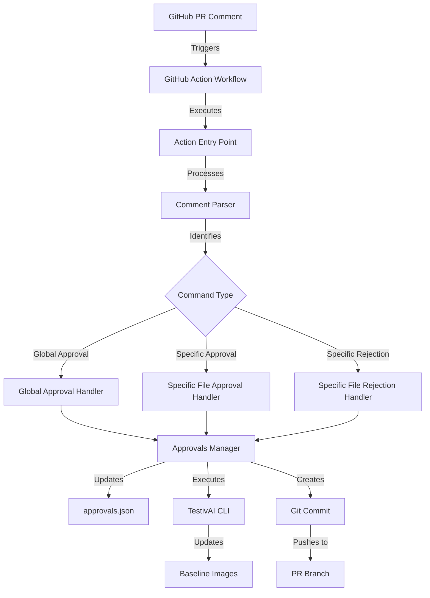
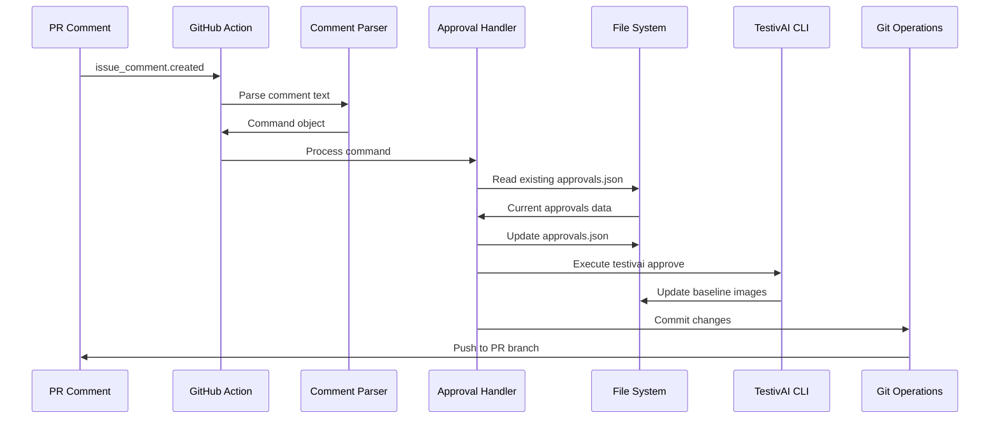

# System Patterns: TestivAI Visual Regression Approval GitHub Action

## System Architecture

The GitHub Action follows a modular architecture with clear separation of concerns:



## Key Technical Decisions

1. **JavaScript Implementation**: Using Node.js for the action implementation provides:
   - Native JSON handling capabilities
   - Extensive ecosystem of GitHub API libraries
   - Compatibility with GitHub Actions runtime
   - Simplified file system operations

2. **Command Pattern**: Using a command-based approach for comment parsing:
   - Clear, predictable syntax for users (`/approve-visuals`, `/reject-visuals`)
   - Extensible for future command types
   - Easy to parse and validate

3. **Metadata Enrichment**: Including comprehensive metadata with each approval:
   - Enables audit trails and accountability
   - Provides context for future reviews
   - Supports potential analytics and reporting

4. **Fallback Behavior**: Implementing smart defaults for global approvals:
   - Reduces friction for common use cases
   - Maintains flexibility for specific needs
   - Handles edge cases gracefully

5. **Git Identity Preservation**: Using the commenter's identity for Git commits:
   - Maintains accurate attribution
   - Preserves GitHub contribution graphs
   - Enhances traceability

## Design Patterns in Use

1. **Command Pattern**: The action interprets text commands from comments and translates them into specific operations.

2. **Strategy Pattern**: Different approval strategies (global vs. specific) are implemented as separate handlers with a common interface.

3. **Adapter Pattern**: The action serves as an adapter between GitHub's comment system and TestivAI's approval mechanism.

4. **Factory Pattern**: Command handlers are created based on the parsed comment type.

5. **Repository Pattern**: Abstracts the storage and retrieval of approval data.

## Component Relationships

### Comment Parser
- **Responsibility**: Extract command intent and parameters from PR comments
- **Inputs**: Raw comment text
- **Outputs**: Structured command object with type and parameters
- **Dependencies**: None

### Approval Handlers
- **Responsibility**: Process specific approval/rejection scenarios
- **Inputs**: Command object, repository context
- **Outputs**: Updated approval entries
- **Dependencies**: File system, TestivAI report structure

### Approvals Manager
- **Responsibility**: Coordinate updates to approvals.json
- **Inputs**: Approval entries, metadata
- **Outputs**: Updated approvals.json file
- **Dependencies**: File system, JSON schema

### Approvals JSON Structure
```json
{
  "approved": [
    "login.png",
    "header.png"
  ],
  "rejected": [
    "settings.png"
  ],
  "new": [
    "signup.png"
  ],
  "deleted": [
    "old-dashboard.png"
  ],
  "meta": {
    "author": "mcbuddy",
    "timestamp": "2025-06-13T21:10:00Z",
    "source": "GitHub PR #42",
    "pr_url": "https://github.com/testivai/testivai-visual-regression/pull/42",
    "commit_sha": "abc123def4567890abcdef1234567890abcdef12",
    "commit_url": "https://github.com/testivai/testivai-visual-regression/commit/abc123def4567890abcdef1234567890abcdef12"
  }
}
```

### Git Operations
- **Responsibility**: Commit and push changes back to PR branch
- **Inputs**: Modified files, committer information
- **Outputs**: Git commit, push to remote
- **Dependencies**: Git, GitHub authentication

### TestivAI CLI Wrapper
- **Responsibility**: Execute TestivAI CLI commands
- **Inputs**: Command parameters
- **Outputs**: CLI execution results
- **Dependencies**: TestivAI CLI, shell execution

## Critical Implementation Paths

### Happy Path Flow
1. PR comment with `/approve-visuals` is created
2. Action workflow triggers
3. Comment is parsed and identified as global approval
4. All pending visual diffs are located
5. approvals.json is updated with approval entries
6. TestivAI CLI is executed to update baselines
7. Changes are committed and pushed to PR branch
8. PR checks are updated to reflect approvals

### Error Handling Paths
1. **Invalid Command Format**:
   - Parse error is detected
   - Action exits with informative error message
   - No changes are made to approvals or baselines

2. **Missing Files**:
   - Required files (e.g., report.json) not found
   - Action attempts to create necessary structure
   - If creation fails, exits with error message

3. **Permission Issues**:
   - Push to PR branch fails due to permissions
   - Action reports error with guidance on required permissions
   - Local changes are preserved for debugging

4. **TestivAI CLI Errors**:
   - CLI command fails
   - Error output is captured and reported
   - Action attempts to continue with remaining operations

## Data Flow



## Configuration and Extension Points

1. **Action Inputs**: Configurable via action.yml
   - Custom approval file paths
   - TestivAI CLI options
   - Git commit message templates

2. **Command Syntax**: Extendable for future commands
   - Potential for additional command types
   - Support for more granular approval options

3. **Reporting**: Customizable feedback mechanisms
   - PR comments
   - Check runs
   - Status updates
